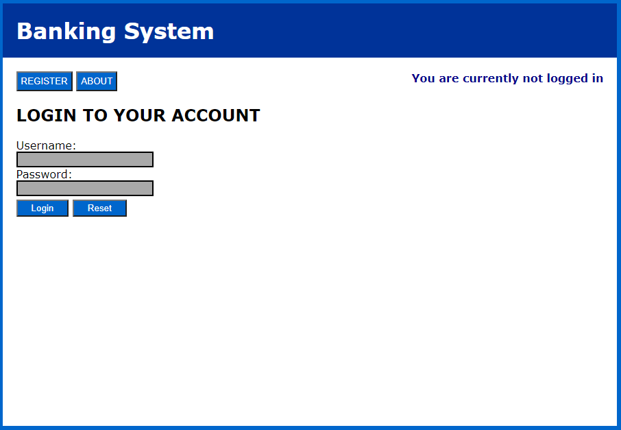
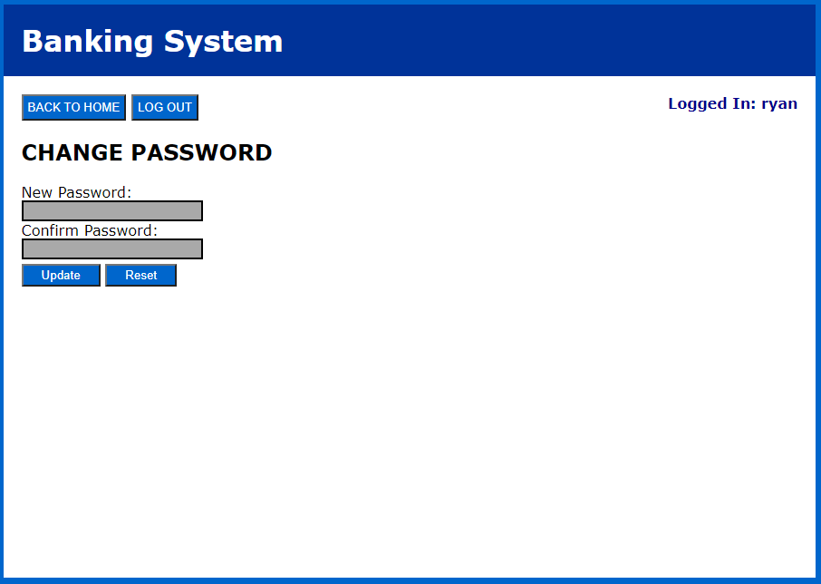

# Bank-System
Online Banking System that gives users the ability to Create, Update and Delete their own account(s) alongside being able to send money to each other.

# Usage
- In the sql/create_database.sql file, make sure to run it to create the actual database where user data will be stored.
- In the php/db_connect.php file, make sure to change the set variables to your corresponding MySQL credentials in order to establish a connection.

